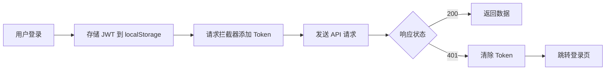

<div align="center">

# 🎨 Synapse Frontend

### ⚡ React 19 | Vite 7 | TanStack | 极简风格

[](https://react.dev/)
[](https://www.typescriptlang.org/)
[](https://vitejs.dev/)
[](https://tailwindcss.com/)
[](LICENSE)

**Synapse (突触)** - 极简风格的内容聚合平台前端应用

</div>

---

## 📖 项目简介

Synapse 前端采用现代化技术栈构建，提供极致的开发体验和优雅的用户界面。

### ✨ 核心特性

- 🎯 **文件路由** - 基于 TanStack Router 的类型安全路由
- 🔄 **数据缓存** - TanStack Query 智能数据获取与缓存
- 🎨 **极简设计** - 暖色调、圆角卡片、柔和阴影
- 🌗 **暗色模式** - 支持亮色/暗色/跟随系统三种主题
- 📝 **多态内容** - 动态渲染代码片段、文章、动态
- 💻 **代码编辑器** - CodeMirror 支持 20+ 语言语法高亮
- 🔐 **私密帖子** - 密码保护内容，会话级解锁
- 💾 **草稿自动保存** - 防止意外丢失编辑内容
- 🔔 **消息通知** - 实时通知，支持点赞、评论、关注、提及
- 🔌 **WebSocket 实时** - 推送式通知，自动重连，JWT 认证
- 🔐 **JWT 认证** - 自动 Token 管理和刷新
- 📱 **响应式** - 完美适配桌面和移动端

---

## 🛠️ 技术栈

| 类别 | 技术 | 版本 | 说明 |
|:---:|:-----|:-----|:-----|
| **框架** |  | 19 | UI 框架 |
| **语言** |  | 5.0+ | 类型安全 |
| **构建** |  | 7 | 构建工具 |
| **样式** |  | 4 | CSS 框架 |
| **路由** |  | 1.x | 文件路由 |
| **数据** |  | 5.x | 数据获取 |
| **HTTP** |  | 1.7+ | HTTP 客户端 |
| **代码** |  | 6.x | 代码编辑器 |
| **Markdown** |  | 9.x | Markdown 渲染 |
| **WebSocket** |  | latest | WebSocket 客户端 |
| **图标** |  | latest | 图标库 |
| **工具** |  | 1.8 | 代码规范 |
| **测试** |  | 2.x | 单元测试 |

---

## 📁 项目结构

```
src/
├── 📄 main.tsx                 # 🚀 应用入口
├── 📄 routeTree.gen.ts         # 🌳 路由树（自动生成）
├── 📄 styles.css               # 🎨 全局样式
│
├── 📂 components/              # 🧩 组件库
│   ├── 📂 layout/              # 📐 布局组件
│   │   ├── Layout.tsx          # 主布局容器
│   │   ├── Navbar.tsx          # 顶部导航栏
│   │   ├── TopBar.tsx          # 顶部栏（搜索、通知、主题）
│   │   └── Sidebar.tsx         # 左侧边栏（标签）
│   │
│   ├── 📂 feed/                # 📰 信息流组件
│   │   ├── Feed.tsx            # 主信息流
│   │   ├── ComposeCard.tsx     # 快速发布卡片
│   │   └── PostCard.tsx        # 帖子卡片（工厂）
│   │
│   ├── 📂 publish/             # ✏️ 发布相关
│   │   ├── PublishModal.tsx    # 发布弹窗（含草稿自动保存）
│   │   ├── RestoreDraftModal.tsx  # 草稿恢复弹窗
│   │   ├── SnippetEditor.tsx   # 代码片段编辑器
│   │   ├── ArticleEditor.tsx   # 文章编辑器
│   │   ├── MomentEditor.tsx    # 动态编辑器
│   │   └── TagInput.tsx        # 标签输入
│   │
│   ├── 📂 cards/               # 🎴 内容卡片变体
│   │   ├── SnippetCard.tsx     # 💻 代码片段卡片
│   │   ├── ArticleCard.tsx     # 📰 文章卡片
│   │   ├── MomentCard.tsx      # 💭 动态卡片
│   │   └── PostCard.tsx        # 通用卡片
│   │
│   ├── 📂 notifications/       # 🔔 通知组件
│   │   ├── NotificationsPanel.tsx  # 通知面板
│   │   └── NotificationItem.tsx    # 通知项
│   │
│   └── 📂 common/              # 🔧 通用组件
│       ├── Button.tsx          # 按钮
│       ├── Input.tsx           # 输入框
│       ├── CodeBlock.tsx       # 代码块
│       ├── ThemeToggle.tsx     # 主题切换
│       └── PasswordModal.tsx   # 密码验证弹窗
│
├── 📂 routes/                  # 🛣️ 路由页面
│   ├── __root.tsx              # 根路由（布局）
│   ├── index.tsx               # 🏠 首页（信息流）
│   ├── login.tsx               # 🔐 登录/注册页
│   ├── search.tsx              # 🔍 搜索页
│   ├── notifications.tsx       # 🔔 通知页
│   ├── bookmarks.tsx           # 🔖 书签页
│   └── 📂 posts/
│       └── $id.tsx             # 📄 帖子详情页
│
├── 📂 hooks/                   # 🪝 自定义 Hooks
│   ├── useAuth.ts              # 🔑 认证状态
│   ├── usePosts.ts             # 📝 帖子列表
│   ├── usePost.ts              # 📄 单个帖子
│   ├── useCreatePost.ts        # ✍️ 创建帖子
│   ├── useTags.ts              # 🏷️ 标签列表
│   ├── useNotifications.ts     # 🔔 通知
│   ├── useNotificationRealtime.ts  # 🔌 WebSocket 实时通知
│   └── useTheme.ts             # 🌗 主题切换
│
├── 📂 services/                # 🌐 API 服务
│   ├── api.ts                  # Axios 实例配置
│   ├── auth.ts                 # 认证 API
│   ├── posts.ts                # 帖子 API
│   ├── tags.ts                 # 标签 API
│   └── notificationsService.ts # 通知 API
│
├── 📂 utils/                   # 🛠️ 工具库
│   ├── draftStorage.ts         # 💾 草稿存储
│   └── privatePost.ts          # 🔐 私密帖子管理
│
├── 📂 types/                   # 📘 TypeScript 类型
│   └── index.ts
│
└── 📂 lib/                     # 🛠️ 工具库
    └── utils.ts                # 通用工具函数
```

---

## 🛣️ 路由说明

| 路径 | 组件 | 说明 |
|:-----|:-----|:-----|
| `/` | `index.tsx` | 🏠 首页，显示所有帖子，支持标签/类型筛选 |
| `/login` | `login.tsx` | 🔐 登录/注册页面 |
| `/search` | `search.tsx` | 🔍 搜索页面，关键词搜索 |
| `/notifications` | `notifications.tsx` | 🔔 通知页面 |
| `/bookmarks` | `bookmarks.tsx` | 🔖 书签页面 |
| `/posts/:id` | `posts/$id.tsx` | 📄 帖子详情页，根据类型动态渲染 |
| `/users/:userId` | `users/$userId.tsx` | 👤 用户主页 |
| `/users/:userId/following` | `users/$userId.following.tsx` | 👥 用户关注列表 |
| `/users/:userId/followers` | `users/$userId.followers.tsx` | 👥 用户粉丝列表 |

---

## 🎨 组件设计

### PostCard 工厂模式

根据帖子类型动态渲染不同组件，实现内容的多态展示：

```tsx
switch (post.type) {
  case 'SNIPPET':
    return <SnippetCard />  // 💻 代码高亮 + 复制按钮
  case 'ARTICLE':
    return <ArticleCard />  // 📰 封面图 + 摘要 + 标题
  case 'MOMENT':
    return <MomentCard />   // 💭 大字体，类似 Twitter
}
```

### 布局组件

| 组件 | 说明 |
|:-----|:-----|
| **Layout** | 主布局容器，包含 Navbar、Sidebar 和内容区 |
| **Navbar** | 顶部导航栏，显示 Logo 和用户信息 |
| **Sidebar** | 左侧边栏，显示热门标签列表 |

### UI 风格

<details>
<summary><b>🎨 配色方案</b></summary>

| 元素 | 颜色 | 用途 |
|:-----|:-----|:-----|
| 背景 | Cream (#fafaf9) | 页面背景 |
| 文字 | 深灰 (#1c1917) | 主要文字 |
| 强调 | Amber (#f59e0b) | 按钮、链接 |
| 次要 | Orange (#ea580c) | 重要提示 |

</details>

<details>
<summary><b>🔲 设计元素</b></summary>

- **阴影**: `shadow-sm` ~ `shadow-md`
- **圆角**: `rounded-xl` (12px)
- **间距**: 4px 基准倍数
- **字体**: 系统默认字体栈

</details>

---

## 🚀 快速开始

### 环境要求

> - **Node.js 18+**
> - **bun** (推荐) 或 npm

### 安装依赖

```bash
cd client
bun install
```

### 开发模式

```bash
bun run dev
```

访问 http://localhost:3000

### 构建生产版本

```bash
bun run build
```

### 预览生产构建

```bash
bun run preview
```

---

## 📜 可用脚本

| 命令 | 说明 |
|:-----|:-----|
| `bun run dev` | 🚀 启动开发服务器（端口 3000） |
| `bun run build` | 📦 构建生产版本 |
| `bun run preview` | 👁️ 预览生产构建 |
| `bun run test` | 🧪 运行测试 |
| `bun run lint` | 🔍 代码规范检查 |
| `bun run format` | ✨ 代码格式化检查 |
| `bun run check` | ✔️ 规范 + 格式检查 |

---

## 🌐 API 配置

API 客户端配置在 `src/services/api.ts`:

```typescript
const API_BASE_URL = 'http://localhost:8080/api'
```

### 拦截器

| 拦截器 | 功能 |
|:-------|:-----|
| **请求拦截器** | 自动添加 JWT Token 到 `Authorization` Header |
| **响应拦截器** | 处理 401 错误，清除认证状态并跳转登录页 |

---

## 🔐 认证流程



---

## 📊 数据获取

使用 **TanStack Query** 进行数据获取和缓存：

```tsx
// 获取帖子列表
const { data, isLoading } = usePosts({ tag, type, page, size })

// 创建帖子
const createPost = useCreatePost()
createPost.mutate(newPostData)
```

**优势：**
- ✅ 自动缓存管理
- ✅ 请求去重
- ✅ 后台自动刷新
- ✅ 乐观更新支持

---

## 💻 代码编辑器

使用 **CodeMirror** 进行代码编辑和展示：

- 支持 20+ 编程语言
- 语法高亮和自动补全
- 行号显示和代码折叠
- 全屏编辑模式
- 主题自动匹配应用配色
- 一键复制代码功能（展示时）

---

## 📝 Markdown 渲染

使用 **react-markdown** + **remark-gfm**:

- ✅ GitHub Flavored Markdown 支持
- ✅ 自动 sanitize HTML（安全）
- ✅ 代码块高亮集成
- ✅ 自定义组件渲染

---

## 💾 草稿自动保存

编辑器支持自动保存草稿到 localStorage：

- 1 秒防抖延迟保存
- 按帖子类型分别存储
- 显示草稿创建时间
- 支持恢复或丢弃草稿
- 私密帖子密码字段也会保存

## 🌗 暗色模式

应用支持三种主题模式：

| 模式 | 说明 |
|:-----|:-----|
| **Light** | 亮色模式，暖色调设计 |
| **Dark** | 暗色模式，slate/gray 灰色系 |
| **System** | 跟随系统偏好自动切换 |

主题切换通过 `ThemeToggle` 组件实现，状态持久化到 localStorage。

## 🔐 私密帖子

私密帖子功能支持密码保护：

- 发帖时可选"私密"并设置密码
- 访问私密内容需输入密码
- 解锁状态存储在 sessionStorage（会话级）
- 帖子作者始终可访问自己的私密内容
- 锁图标标识私密内容

## 🔌 WebSocket 实时通知

前端使用 `react-use-websocket` 实现实时通知推送：

### useNotificationRealtime Hook

```tsx
import { useNotificationRealtime } from '@/hooks/useNotificationRealtime';

function App() {
  useNotificationRealtime(); // 自动连接并处理通知
  // ...
}
```

### 消息类型

| 类型 | 数据 | 处理方式 |
|:-----|:-----|:--------|
| `unreadCount` | `{ count: number }` | 更新未读计数缓存 |
| `notification` | `NotificationDto` | 失效通知列表查询 |

### 连接参数

- **URL**: `ws://host/api/ws/notifications?token=xxx`
- **重连次数**: 10 次
- **重连间隔**: 1 秒
- **协议自动切换**: HTTP → WS, HTTPS → WSS

### JWT 认证

Token 通过 query parameter 传递，与服务端 `JwtHandshakeInterceptor` 配合完成握手认证。

## 💡 开发建议

### 添加新路由

在 `src/routes/` 目录下创建文件，路由树会自动生成：

```bash
src/routes/
├── about.tsx          # /about
└── profile/
    └── $id.tsx        # /profile/:id
```

### 添加新组件

按功能分类放置组件：

```
通用组件    → components/common/
布局组件    → components/layout/
特定功能    → components/<feature>/
```

### 样式规范

```tsx
// 优先使用 Tailwind CSS 类名
<div className="flex items-center gap-4">

// 组件变体使用 CVA
const buttonVariants = cva("base-classes", {
  variants: { variant: { primary: "...", secondary: "..." } }
})

// 合并类名使用 cn() 工具函数
className={cn("base-class", isActive && "active-class")}
```

---

## 🔧 代码规范

项目使用 **Biome** 进行代码规范检查和格式化：

```bash
# 检查代码规范
bun run lint

# 格式化代码
bun run format -- --write .

# 一次性检查并修复
bun run check -- --write .
```

---

## 📄 许可证

[MIT](LICENSE)
